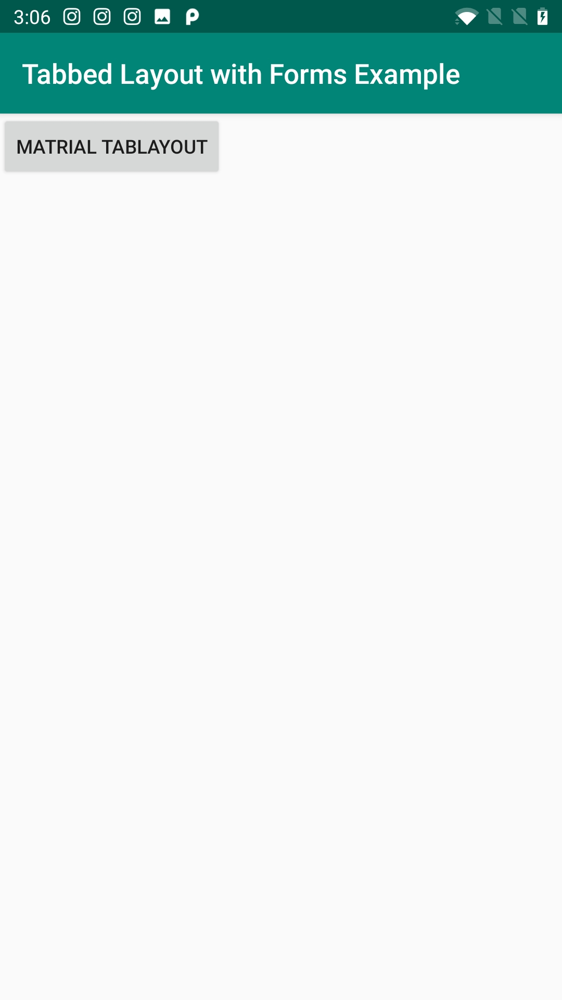
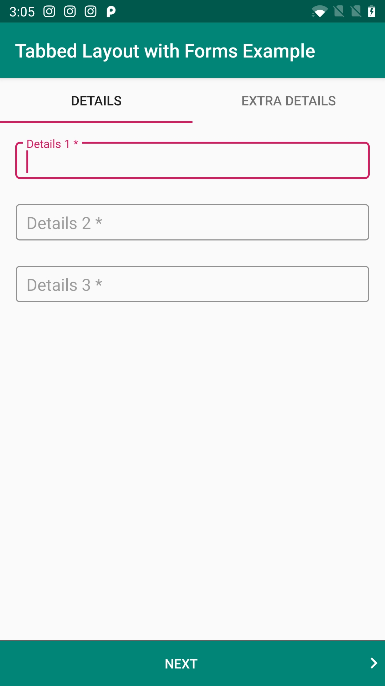
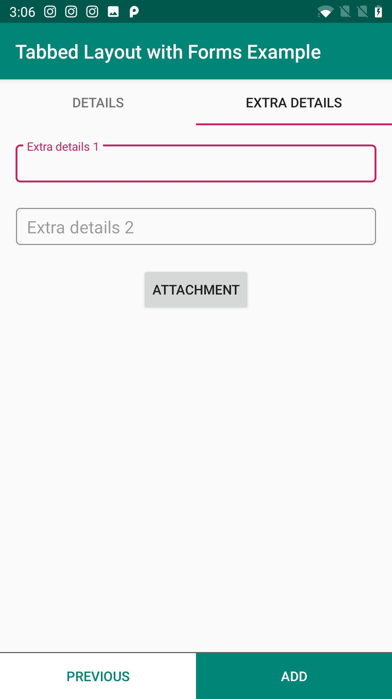

Material TabLayout In Fragment with forms.
===================================

Sample demonstrating the use of Forms in Material TabLayout

Introduction
------------

- Sample demonstrating the use of Material TabLayout with prev and next buttons.
- Disabled swipe scrolling.
- Tab swipe on button click.

Screenshots
-------------

 

